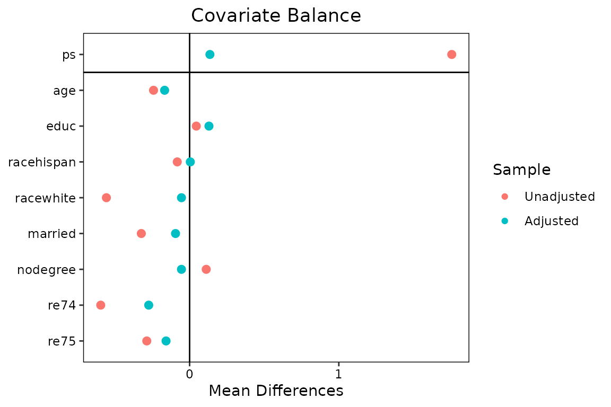

# Getting Started with oalasso

## Introduction: which covariates belong in a propensity score model?

A propensity score (PS) model does not need — and should not get — every
covariate that predicts treatment. What matters for the treatment-effect
estimate is a different set: the **confounders** (covariates related to
both treatment and outcome) and, for efficiency, the **pure outcome
predictors**. Two kinds of covariates should be kept *out* of the PS
model:

- **Instruments** — covariates that predict treatment but are unrelated
  to the outcome except through treatment. Including them increases the
  variance of the effect estimate without reducing bias (Brookhart et
  al. 2006), and, when some confounding remains unmeasured, *amplifies*
  the bias that the unmeasured confounding contributes (“Z-bias”; Myers
  et al. 2011). Strong instruments also push propensity scores toward 0
  and 1, creating near-positivity violations and unstable weights.
- **Noise variables** — covariates related to neither treatment nor
  outcome, which only add variance.

The **outcome-adaptive lasso** (OAL) of Shortreed & Ertefaie (2017)
automates this selection. It fits a logistic PS model with an adaptively
weighted lasso penalty, where each covariate’s penalty weight is
$`|\hat\beta_j|^{-\gamma}`$ and $`\hat\beta_j`$ is that covariate’s
coefficient in a linear regression of the *outcome* on treatment and all
covariates. Covariates with no outcome association get an exploding
penalty and are forced out of the PS model; confounders and outcome
predictors survive. The penalty strength $`\lambda_n`$ is then tuned by
the **weighted absolute mean difference** (wAMD), a balance criterion
that weights each covariate’s post-weighting imbalance by its
outcome-coefficient magnitude — so the tuning, like the penalty, is
outcome-oriented.

`oalasso` implements OAL and its elastic-net generalization **GOAL**
(Baldé, Yang & Lefebvre 2023; `method = "goal"`), on top of `glmnet`
with an exact penalty-scale correction so that the *published*
objectives and tuning grids are reproduced (see
[`vignette("method-details", package = "oalasso")`](https://kabajiro.github.io/oalasso/articles/method-details.md)).
Like its companion package [psAve](https://github.com/kabajiro/psAve),
the deliverable is deliberately modest: `fit$ps` is a plain numeric
vector of propensity scores, ready for
[`MatchIt::matchit()`](https://kosukeimai.github.io/MatchIt/reference/matchit.html)
as a distance measure,
[`WeightIt::weightit()`](https://ngreifer.github.io/WeightIt/reference/weightit.html)
as a propensity score, or
[`psAve::psave()`](https://rdrr.io/pkg/psAve/man/psave.html) as an
appended candidate.

## Installation

``` r

# install.packages("remotes")
remotes::install_github("kabajiro/oalasso")
```

The solver (`glmnet`) and the balance machinery (`cobalt`) are Imports;
`MatchIt`, `WeightIt`, and `psAve` are Suggests, needed only for the
corresponding downstream steps.

## A first look: instruments are excluded, confounders are kept

A small simulated example in the spirit of Shortreed & Ertefaie’s first
scenario makes the selection behavior visible. `x1` and `x2` are
confounders, `x3` and `x4` predict only the outcome, `x5` and `x6`
predict only treatment (instruments):

``` r

library(oalasso)

set.seed(20260702)
n <- 500
X <- matrix(rnorm(n * 6), n, 6, dimnames = list(NULL, paste0("x", 1:6)))
A <- rbinom(n, 1, plogis(X %*% c(1, 1, 0, 0, 1, 1)))
Y <- as.numeric(2 * A + X %*% c(0.6, 0.6, 0.6, 0.6, 0, 0) + rnorm(n))
sim <- data.frame(A, Y, X)

fit.sim <- oal(A ~ x1 + x2 + x3 + x4 + x5 + x6, data = sim, outcome = ~ Y)
fit.sim
#> OAL (Shortreed & Ertefaie 2017, doi:10.1111/biom.12679)
#> An oal object (outcome-adaptive lasso propensity score)
#>  - estimand: ATE;  refit: FALSE (penalized fit)
#>  - sample:   500 units (248 treated, 252 control); 6 covariate column(s)
#>  - selected: delta = -10 (lambda_n = 1.02e-27), gamma = 26
#>  - wAMD at the selection: 0.122
#> 
#> Retained (outcome-related):
#>   x1  (|b| = 0.572)
#>   x2  (|b| = 0.647)
#>   x3  (|b| = 0.600)
#>   x4  (|b| = 0.618)
#> Excluded (outcome-unrelated):
#>   x5  (|b| = 0.00339)
#>   x6  (|b| = 0.06668)
#> 
#> Excluded covariates showed no outcome association; excluding instruments and noise variables from a propensity score model improves precision and avoids bias amplification (Brookhart et al. 2006; Myers et al. 2011).
#> 
#> Next:
#>   MatchIt::matchit(A ~ x1 + x2 + x3 + x4 + x5 + x6, data = sim, distance = x$ps)
#>     or: oal_match(x)
#>   WeightIt::weightit(A ~ x1 + x2 + x3 + x4 + x5 + x6, data = sim, ps = x$ps, estimand = "ATE")
#>     or: oal_weight(x)
#>   ($ps is numeric, named by rownames(sim), strictly inside (0, 1);
#>    it also satisfies psAve::psave(ps.append = cbind(oal = x$ps)).)
```

The seed is set for the *data simulation* only:
[`oal()`](https://kabajiro.github.io/oalasso/reference/oal.md) itself is
fully deterministic (there is no `seed` argument because nothing
stochastic happens inside).

### Reading the printout

The printed output, top to bottom:

1.  **Provenance line.** The first line always states exactly which
    published method the fit implements, with its DOI — here
    `"OAL (Shortreed & Ertefaie 2017, doi:10.1111/biom.12679)"`. Options
    that leave the validated territory (a binomial outcome model,
    `refit = TRUE`, user-supplied `outcome.coef`) change or extend this
    label, so the printout is honest about what you can cite; a GOAL fit
    states whether the `lambda2` grid is the author’s published grid
    (Baldé 2025 supplement) or user-specified.
2.  **The selected tuning point.** `delta` is the selected exponent from
    the `lambda` grid ($`\lambda_n = n^\delta`$), `gamma` the paired
    penalty exponent, and (for GOAL) `lambda2` the selected ridge
    parameter, together with the achieved wAMD value.
3.  **Retained vs excluded covariates.** Covariates the penalized PS
    model kept (“Retained (outcome-related)”) and dropped (“Excluded
    (outcome-unrelated)”), each with its outcome-coefficient magnitude
    $`|\hat\beta_j|`$ — the quantity that drove both the penalty and the
    tuning. In the simulation above, `x5` and `x6` (the instruments)
    land in the excluded list, with a one-line reminder of *why*
    exclusion is desirable (Brookhart et al. 2006; Myers et al. 2011).
4.  **The literal next call.** The printout ends by echoing the exact
    [`MatchIt::matchit()`](https://kosukeimai.github.io/MatchIt/reference/matchit.html)
    call (with *your* formula and data name) that carries `fit$ps`
    forward, or the `oal_match(fit)` shortcut.

If more than 5% of the propensity scores sit at the clipping bounds
(`clip = c(0.01, 0.99)` by default), the printout appends a
near-positivity warning and suggests `method = "goal"`, whose ridge term
stabilizes the weights (Jones, Ertefaie & Shortreed 2023).

## Workflow 1: matching

The realistic workflow uses the `lalonde` data from `MatchIt`. The
`outcome` argument is a one-sided formula naming the outcome variable;
the outcome (weight) model always uses the same covariates as the PS
model, which is intrinsic to the method:

``` r

data("lalonde", package = "MatchIt")

fit <- oal(treat ~ age + educ + race + married + nodegree + re74 + re75,
           data = lalonde, outcome = ~ re78)
fit
#> OAL (Shortreed & Ertefaie 2017, doi:10.1111/biom.12679)
#> An oal object (outcome-adaptive lasso propensity score)
#>  - estimand: ATE;  refit: FALSE (penalized fit)
#>  - sample:   614 units (185 treated, 429 control); 8 covariate column(s)
#>  - selected: delta = -10 (lambda_n = 1.31e-28), gamma = 26
#>  - wAMD at the selection: 877
#> 
#> Retained (outcome-related):
#>   age  (|b| =  128)
#>   educ  (|b| = 1062)
#>   racehispan  (|b| =  560)
#>   racewhite  (|b| =  621)
#>   married  (|b| =  201)
#>   nodegree  (|b| =  126)
#>   re74  (|b| = 1920)
#>   re75  (|b| =  763)
#> Excluded (outcome-unrelated):
#>   (none)
#> 
#> Next:
#>   MatchIt::matchit(treat ~ age + educ + race + married + nodegree + re74 + re75, data = lalonde, distance = x$ps)
#>     or: oal_match(x)
#>   WeightIt::weightit(treat ~ age + educ + race + married + nodegree + re74 + re75, data = lalonde, ps = x$ps, estimand = "ATE")
#>     or: oal_weight(x)
#>   ($ps is numeric, named by rownames(lalonde), strictly inside (0, 1);
#>    it also satisfies psAve::psave(ps.append = cbind(oal = x$ps)).)
```

`fit$ps` is a numeric vector named by `rownames(lalonde)`, strictly
inside (0, 1), and can be passed directly to `matchit()` as the
`distance`:

``` r

m <- MatchIt::matchit(treat ~ age + educ + race + married + nodegree + re74 + re75,
                      data = lalonde, distance = fit$ps, method = "nearest")
```

Retyping the formula and data name invites row-misalignment mistakes, so
— as in `psAve` — a thin wrapper reuses the formula and data stored in
the fit; all other arguments are forwarded verbatim to `matchit()` and
the result is an ordinary `matchit` object:

``` r

m <- oal_match(fit, method = "nearest", caliper = 0.2)
summary(m)$nn
#>               Control Treated
#> All (ESS)         429     185
#> All               429     185
#> Matched (ESS)     113     113
#> Matched           113     113
#> Unmatched         316      72
#> Discarded           0       0
```

Note that matching estimates an ATT-type contrast, while
[`oal()`](https://kabajiro.github.io/oalasso/reference/oal.md) tunes the
wAMD with ATE weights by default (Shortreed & Ertefaie’s convention —
this differs from `psave()`, whose default estimand is ATT). For a
matching analysis you may prefer to align the tuning with the estimand:

``` r

fit.att <- oal(treat ~ age + educ + race + married + nodegree + re74 + re75,
               data = lalonde, outcome = ~ re78, estimand = "ATT")
m.att <- oal_match(fit.att, method = "nearest")
```

## Workflow 2: weighting

For inverse probability weighting,
[`oal_weight()`](https://kabajiro.github.io/oalasso/reference/oal_weight.md)
hands `fit$ps` to
[`WeightIt::weightit()`](https://ngreifer.github.io/WeightIt/reference/weightit.html)
as the propensity score, at the fit’s estimand by default:

``` r

w <- oal_weight(fit)          # = weightit(..., ps = fit$ps, estimand = "ATE")
summary(w)
#>                   Summary of weights
#> 
#> - Weight ranges:
#> 
#>           Min                                  Max
#> treated 1.172 |---------------------------| 40.071
#> control 1.01  |-|                            4.743
#> 
#> - Units with the 5 most extreme weights by group:
#>                                                 
#>            NSW68  NSW116   NSW10  NSW137  NSW124
#>  treated  13.543  15.986  23.295  23.385  40.071
#>          PSID412 PSID388 PSID196 PSID226 PSID118
#>  control   4.029   4.059   4.239   4.522   4.743
#> 
#> - Weight statistics:
#> 
#>         Coef of Var   MAD Entropy # Zeros
#> treated       1.478 0.807   0.534       0
#> control       0.552 0.391   0.118       0
#> 
#> - Effective Sample Sizes:
#> 
#>            Control Treated
#> Unweighted  429.    185.  
#> Weighted    329.02   58.33
```

Equivalently, `weights(fit)` returns the IPW weights implied by `fit$ps`
at the fitted estimand directly, without `WeightIt`:

``` r

head(weights(fit))
#>     NSW1     NSW2     NSW3     NSW4     NSW5     NSW6 
#> 1.565629 4.451580 1.474424 1.288178 1.425257 1.430478
```

## How the tuning works: the wAMD criterion

For each candidate penalty $`\lambda_n = n^\delta`$ on the grid
(`lambda` supplies the *exponents* $`\delta`$; the default is Shortreed
& Ertefaie’s grid),
[`oal()`](https://kabajiro.github.io/oalasso/reference/oal.md) fits the
penalized PS model, forms IPW weights $`w_i`$ from the clipped scores,
and computes the weighted absolute mean difference

``` math
\mathrm{wAMD}(\lambda_n) \;=\; \sum_{j=1}^{p} |\hat\beta_j| \,
\left| \frac{\sum_i w_i X_{ij} A_i}{\sum_i w_i A_i}
     - \frac{\sum_i w_i X_{ij} (1 - A_i)}{\sum_i w_i (1 - A_i)} \right|,
```

summed over *all* covariate columns (on the standardized scale),
including those the model excluded. The grid point minimizing wAMD is
selected. Because each covariate’s imbalance is weighted by its
outcome-coefficient magnitude $`|\hat\beta_j|`$, residual imbalance on
an instrument (with $`\hat\beta_j \approx 0`$) costs almost nothing —
the criterion deliberately does not reward balancing covariates that
cannot cause confounding. Each $`\delta`$ is paired with a penalty
exponent $`\gamma = 2(2 - \delta + 1)`$ so that the pair satisfies the
method’s theoretical rate conditions;
[`vignette("method-details", package = "oalasso")`](https://kabajiro.github.io/oalasso/articles/method-details.md)
gives the formulas, the provenance of every default, and the exact
`glmnet` correction that makes the published objective reproducible.

The criterion path is stored and plottable:

``` r

plot(fit, type = "wamd")
```


and
[`oal_wamd()`](https://kabajiro.github.io/oalasso/reference/oal_wamd.md)
— the exported single source of truth for the criterion — scores *any*
candidate propensity score on the same formula, which is convenient for
comparing an OAL score against an external one.

## `summary()`, balance, and the other accessors

``` r

summary(fit)
#> OAL (Shortreed & Ertefaie 2017, doi:10.1111/biom.12679)
#> Summary of an oal fit
#> Call: oal(formula = treat ~ age + educ + race + married + nodegree + re74 + re75, data = lalonde, outcome = ~re78)
#> 
#> Estimand: ATE;  criterion: wamd (weighted absolute mean difference);  refit: FALSE
#> Sample: 185 treated, 429 control
#> Selected: delta = -10 (lambda_n = 1.31e-28), gamma = 26;  wAMD = 877
#> 
#> Selection table (outcome coefficients on the standardized scale):
#>         term outcome.coef penalty.factor   coef selected     role
#> 1        age      128.234       1.56e-55  0.016     TRUE retained
#> 2       educ     1061.689       2.11e-79  0.161     TRUE retained
#> 3 racehispan      560.127       3.50e-72 -2.082     TRUE retained
#> 4  racewhite      620.617       2.44e-73 -3.065     TRUE retained
#> 5    married      200.536       1.39e-60 -0.832     TRUE retained
#> 6   nodegree      125.523       2.71e-55  0.707     TRUE retained
#> 7       re74     1919.923       4.31e-86  0.000     TRUE retained
#> 8       re75      763.035       1.13e-75  0.000     TRUE retained
#> 
#> Best grid row per lambda2 (by wAMD):
#>   lambda2 delta lambda.n gamma        s wamd n.selected refit.converged
#> 1      NA   -10 1.31e-28    26 1.14e-86  877          8              NA
#>   selected
#> 1     TRUE
#> 
#> Outcome (weight) model: lm(y ~ A + X)
#>           term estimate  se
#> 1  (Intercept)     6330 366
#> 2            A     1550 781
#> 3          age      128 321
#> 4         educ     1060 418
#> 5   racehispan      560 328
#> 6    racewhite      621 385
#> 7      married      201 343
#> 8     nodegree      126 409
#> 9         re74     1920 377
#> 10        re75      763 345
#> 
#> Balance (original-scale covariates):
#>            smd.un smd.wt ks.un ks.wt  
#> age         0.242  0.168 0.158 0.191 *
#> educ        0.045  0.130 0.111 0.077 *
#> racehispan  0.277  0.016 0.083 0.005  
#> racewhite   1.408  0.138 0.558 0.055 *
#> married     0.721  0.210 0.324 0.094 *
#> nodegree    0.235  0.116 0.111 0.055 *
#> re74        0.596  0.274 0.447 0.312 *
#> re75        0.287  0.158 0.288 0.153 *
#> ---
#> '*' = weighted SMD > 0.1
```

[`summary()`](https://rdrr.io/r/base/summary.html) shows the full
per-covariate selection table (`fit$selected`: outcome coefficient,
penalty factor, PS coefficient, retained/excluded role), a summary of
the tuning path, the outcome-model coefficient table, and a covariate
balance table (`fit$balance`: unweighted and weighted SMD and KS
statistics, computed by `cobalt` with the selected weights — the same
layout as `psave$balance`).

Balance is also available through the `cobalt` generic, and as a
Love-style plot:

``` r

cobalt::bal.tab(fit)
#> Balance Measures
#>                Type Diff.Adj
#> ps         Distance   0.1361
#> age         Contin.  -0.1675
#> educ        Contin.   0.1296
#> racehispan   Binary   0.0047
#> racewhite    Binary  -0.0546
#> married      Binary  -0.0944
#> nodegree     Binary  -0.0547
#> re74        Contin.  -0.2740
#> re75        Contin.  -0.1579
#> 
#> Effective sample sizes
#>            Control Treated
#> Unadjusted  429.    185.  
#> Adjusted    329.02   58.33
plot(fit, type = "balance")
#> Warning in cobalt::love.plot(x = cobalt::bal.tab(x = structure(list(ps = c(NSW1 = 0.638720962917443, : Standardized mean differences and raw mean differences are present in the same
#> plot. Use the `stars` argument to distinguish between them and appropriately
#> label the x-axis. See `love.plot()` for details.
```



Further accessors: `coef(fit)` (PS coefficients, original or
standardized scale), `predict(fit, newdata)` (propensity scores for new
data, no refitting machinery needed), and `fit$path` / `fit$sets` /
`fit$coef.path` for the full grid history (kept unless
`keep.path = FALSE`).

## GOAL, in one paragraph

When covariates are strongly correlated or positivity is fragile, plain
OAL can select erratically among correlated confounders and produce
unstable weights. `method = "goal"` adds an elastic-net ridge term
$`\lambda_2 \sum_j \alpha_j^2`$ to the objective (Baldé, Yang & Lefebvre
2023), selected jointly with $`(\lambda_n, \gamma)`$ by the same wAMD
criterion; `lambda2 = 0` is always on the grid, so GOAL nests plain OAL
and can never do worse on the criterion. The default `lambda2` grid is
the author’s published grid (Baldé 2025 supplement, “taken from Zou and
Hastie (2005)”), and the printed provenance line says so. See the
method-details vignette.

``` r

fit.goal <- oal(treat ~ age + educ + race + married + nodegree + re74 + re75,
                data = lalonde, outcome = ~ re78, method = "goal")
```

## Practical policies worth knowing

- **Missing data are an error, never a silent drop.** Any `NA` in the
  treatment, the PS covariates, or the outcome variable stops with a
  message naming the offending variables. Impute first if that is your
  analysis plan.
- **Everything is deterministic.** Same data, same arguments, same
  result — there is no `seed` argument.
- **Using the outcome at the design stage is by design.** OAL uses
  outcome *coefficients* to decide which covariates to select, not to
  pick the estimate you like; the treatment-effect estimation itself
  stays downstream in `MatchIt`/`WeightIt`/`survey`/`marginaleffects`.

## Where to go next

- [`vignette("psave-integration", package = "oalasso")`](https://kabajiro.github.io/oalasso/articles/psave-integration.md)
  — appending the OAL score as a candidate in
  [`psAve::psave()`](https://rdrr.io/pkg/psAve/man/psave.html), when
  that composition helps, and its caveats.
- [`vignette("method-details", package = "oalasso")`](https://kabajiro.github.io/oalasso/articles/method-details.md)
  — all formulas, the exact `glmnet` penalty-scale correction, the
  provenance of every default, differences from the author’s legacy
  code, and honest notes on nonlinear extensions.

## References

Baldé, I., Yang, Y. A., & Lefebvre, G. (2023). Reader reaction to
“Outcome-adaptive lasso: Variable selection for causal inference” by
Shortreed and Ertefaie (2017). *Biometrics*, 79(1), 514–520.
<doi:10.1111/biom.13683>

Brookhart, M. A., Schneeweiss, S., Rothman, K. J., Glynn, R. J., Avorn,
J., & Stürmer, T. (2006). Variable selection for propensity score
models. *American Journal of Epidemiology*, 163(12), 1149–1156.
<doi:10.1093/aje/kwj149>

Jones, J., Ertefaie, A., & Shortreed, S. M. (2023). Rejoinder to “Reader
reaction to ‘Outcome-adaptive lasso: Variable selection for causal
inference’ by Shortreed and Ertefaie (2017)”. *Biometrics*, 79(1),
521–525. <doi:10.1111/biom.13681>

Myers, J. A., Rassen, J. A., Gagne, J. J., Huybrechts, K. F.,
Schneeweiss, S., Rothman, K. J., Joffe, M. M., & Glynn, R. J. (2011).
Effects of adjusting for instrumental variables on bias and precision of
effect estimates. *American Journal of Epidemiology*, 174(11),
1213–1222. <doi:10.1093/aje/kwr364>

Shortreed, S. M., & Ertefaie, A. (2017). Outcome-adaptive lasso:
Variable selection for causal inference. *Biometrics*, 73(4), 1111–1122.
<doi:10.1111/biom.12679>
